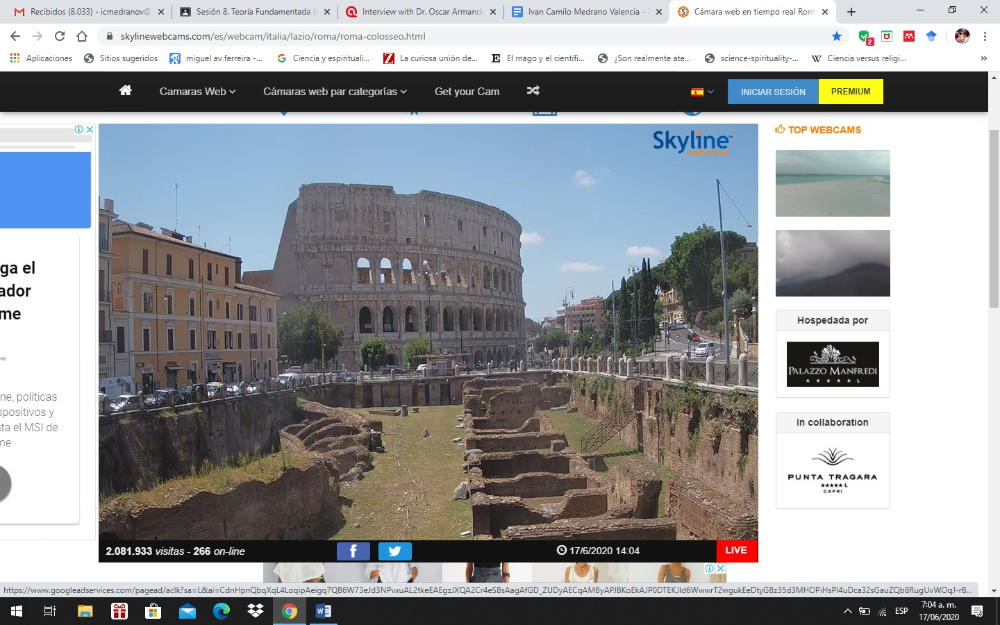

## ¿Viajar digitalmente?
> Lo real se asemeja a lo posible; por el contrario, lo actual no se
parece en nada a lo virtual: le responde. - Pierre Levy

Tras indagar los diferentes sitios web a través de *slack,* llama poderosamente la atención indagar en  [skyline webs cam] (https://www.skylinewebcams.com/es/home.html), un  sitio y una  a posibilidad tecnológica hasta ahora desconocida. En todo caso, después de hacer una indagación por los diferentes lugares y ciudades del mundo, en todos los continentes y en tiempo real a través de la visualización que ofrece una cámara de panorámicas de sitios representativos, asalta una pregunta muy común, incluso para estos tiempos contingentes:

__¿Acaso hemos depositado mucha confianza en una tecnología que facilitandonos la vida y protegiéndonos, vigila y controla a través de sus múltiples y sofisticados sumideros nuestra información?__

